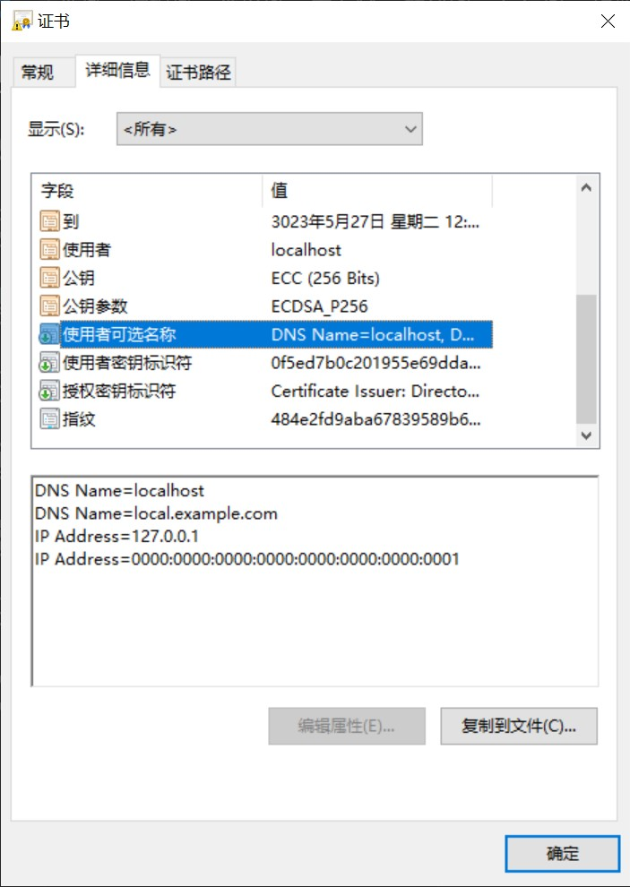

# localssl

生成自签证书。  

***
## 开始使用
### Windows
首先安装 [openssl](https://slproweb.com/products/Win32OpenSSL.html) 并设置环境变量，可参考 [博客园文章](https://www.cnblogs.com/dingshaohua/p/12271280.html) 的安装方式二。    
然后安装 [git for windows](https://gitforwindows.org/) 。
然后拉取并运行 `./generateAll.bat` 生成自签机构与域名证书。  
```cmd
git clone https://github.com/bddjr/localssl
cd localssl
./generateAll.bat
```

### Linux
```shell
git clone https://github.com/bddjr/localssl
cd localssl
chmod 777 ./generateAll.sh
chmod 777 ./generateDomain.sh
./generateAll.sh
```

***
## 编辑 localssl.ext
按照如下格式
```
subjectAltName = DNS:localhost, DNS:local.example.com, IP:127.0.0.1, IP:::1
```

然后重新生成，再打开 `out/localhost.crt` ，点击“详细信息”，找到“使用者可选名称”。  



***
## 信任证书
将 `out/localssl.crt` 添加到操作系统里的 “受信任的根证书颁发机构” 。

***
部分内容参考了  
https://learn.microsoft.com/zh-cn/azure/application-gateway/self-signed-certificates  
以及互联网上的其它文章。  
